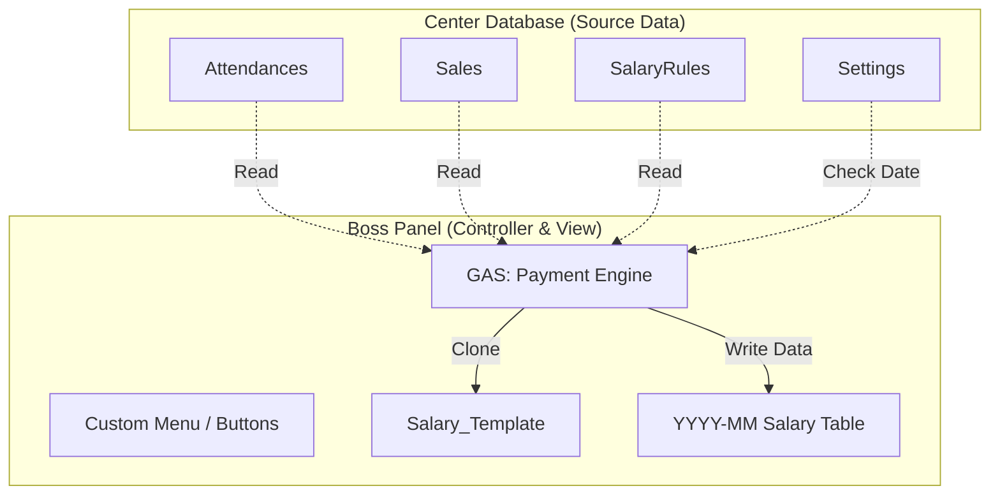
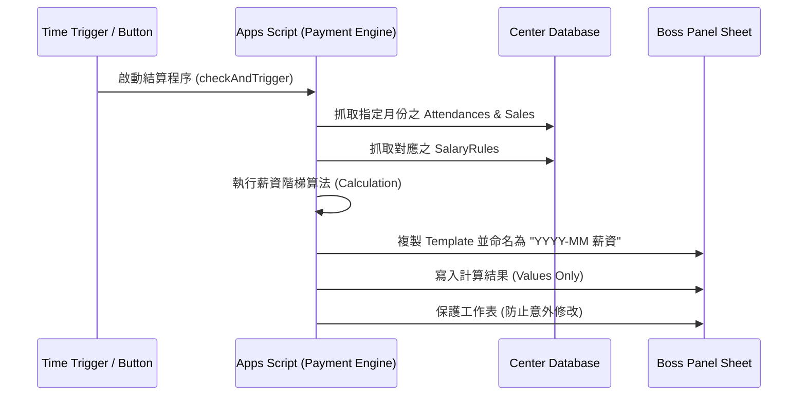

# GSPanelv1.md: 老闆管理面板與薪資結算系統設計

> **核心目標：** 透過 Google Apps Script (GAS) 建立一個與中心資料庫 (Center Database) 隔離的互動面板，實作自動化薪資計算與數據快照。

## 1. 系統架構圖 (System Architecture)

### 1.1 封裝圖 (Package Diagram)
展示資料庫 (Backend) 與面板 (Frontend) 之間的隔離關係。



### ### 1.2 序列圖 (Sequence Diagram)
展示自動化生成「每月薪資統計表」的過程。



---

## ## 2. 薪資計算邏輯 (Payment Calculation Logic)

根據你提供的欄位，薪資由兩大區塊組成：

### ### A. 出勤薪資 (Attendance Pay)
針對每一筆出勤紀錄（單堂課），計算公式如下：
1.  **基礎費：** `BaseRateZero` (不論人數)。
2.  **人頭費：** `StudentCount` × `BaseRate1toN`。
3.  **階梯獎金 (Tiers)：**
    * 若 `StudentCount` > `TierStartAtNplus1`：
    * 獎金 = `floor((StudentCount - TierStartAtNplus1) / TierStep) * TierBonus`。
4.  **額外獎金：** 若該課堂包含 5 堂卡或 10 堂卡，則加上 `Bonus5Card` 或 `Bonus10Card`。

### ### B. 銷售佣金 (Sales Commission)
1.  **加總：** 篩選該月份所有屬於該教練的 `Sales` 紀錄。
2.  **累加：** `sum(Sales.commission)`。

**總薪資 = Σ(出勤薪資) + Σ(銷售佣金)**

---

## ## 3. 實作階段與詳細步驟

### ### 第一階段：環境配置 (Current)
* **Step 1:** 在老闆面板建立 `Template_Salary`，設定好欄位（教練、出勤費、佣金、總計、明細連結）。
* **Step 2:** 在 `Center Database` 的 `Settings` 填入 `PaymentDay`（例如：5）。

### ### 第二階段：開發結算引擎 (Current - GAS Code)
這是核心代碼，負責處理跨表抓取與計算。

```javascript
/**
 * GSPanelv1 - 薪資結算核心
 * 部署於 Boss Panel Sheet
 */

const CENTER_DB_ID = 'YOUR_CENTER_DB_SPREADSHEET_ID';

// 主功能：手動或自動執行
function generateMonthlyPayment() {
  const ss = SpreadsheetApp.getActiveSpreadsheet();
  const db = SpreadsheetApp.openById(CENTER_DB_ID);
  
  // 1. 設定目標月份 (預設為上個月，或手動指定)
  const targetDate = new Date();
  targetDate.setMonth(targetDate.getMonth() - 1); // 結算上個月
  const monthStr = Utilities.formatDate(targetDate, "GMT+8", "yyyy-MM");

  // 2. 抓取資料
  const attendanceData = getRawData(db, 'Attendances', monthStr);
  const salesData = getRawData(db, 'Sales', monthStr);
  const rules = getRawData(db, 'SalaryRules', monthStr); // 抓取 EffectiveMonth 對應的規則

  // 3. 執行計算 (核心算法)
  const report = calculateFinalPay(attendanceData, salesData, rules);

  // 4. 生成快照 Table
  writeToNewSheet(ss, monthStr, report);
}

/**
 * 薪資計算引擎
 */
function calculateFinalPay(attendances, sales, rules) {
  let coachMap = {};

  // A. 計算出勤
  attendances.forEach(row => {
    const [id, date, cId, cName, courseId, courseName, count, calcSalary] = row;
    const rule = rules.find(r => r[1] === row[1].slice(0, 7)) || rules[0]; // 匹配規則
    
    // 依據規則重新計算 (確保正確性)
    let classPay = rule[2]; // BaseRateZero
    classPay += count * rule[3]; // StudentCount * BaseRate1toN
    
    if (count >= rule[4]) { // TierStartAtNplus1
      classPay += Math.floor((count - rule[4]) / rule[5]) * rule[6]; // Tiers logic
    }

    if (!coachMap[cId]) coachMap[cId] = { name: cName, attendPay: 0, commission: 0 };
    coachMap[cId].attendPay += classPay;
  });

  // B. 計算佣金
  sales.forEach(row => {
    const [id, date, cId, cName, pName, qty, price, total, comm] = row;
    if (coachMap[cId]) coachMap[cId].commission += comm;
  });

  // 格式化為表格
  return Object.keys(coachMap).map(id => {
    const c = coachMap[id];
    return [id, c.name, c.attendPay, c.commission, c.attendPay + c.commission];
  });
}

/**
 * 輔助功能：複製 Template 並寫入
 */
function writeToNewSheet(ss, monthName, data) {
  const sheetName = monthName + " 薪資報表";
  if (ss.getSheetByName(sheetName)) ss.deleteSheet(ss.getSheetByName(sheetName));
  
  const template = ss.getSheetByName('Template_Salary');
  const newSheet = template.copyTo(ss).setName(sheetName).showSheet();
  
  if (data.length > 0) {
    newSheet.getRange(2, 1, data.length, data[0].length).setValues(data);
  }
}

/**
 * 通用抓取器：篩選特定月份資料
 */
function getRawData(db, sheetName, monthFilter) {
  const sheet = db.getSheetByName(sheetName);
  const data = sheet.getDataRange().getValues().slice(1);
  return data.filter(row => row[1].toString().includes(monthFilter)); // 假設日期在第2欄
}
```

### ### 第三階段：自動化觸發與測試 (Planning)
* **測試方法：**
    * 在 GAS 編輯器選取 `generateMonthlyPayment` 直接執行。
    * 利用我之前建議的「繪圖按鈕」指派該函數，點擊即可測試。
* **正式部署：**
    * 設定 `Time-driven trigger` 每天跑一次 `checkAndTriggerPayment`（檢查 `Settings` 表的日期）。

---

## ## 4. 常見問題與解決方案 (Analysis)

* **Q: GAS 複製 Template 會連公式一起複製嗎？**
    * **A:** 會。但我建議在寫入 `data` 後，使用 `newSheet.getDataRange().copyTo(newSheet.getDataRange(), {contentsOnly:true})`。這會將所有公式轉為「數值」，防止未來中心資料庫變動時，已結算的歷史薪資跟著跑掉。
* **Q: 如果教練中途換薪資規則？**
    * **A:** 你的 `SalaryRules` 有 `EffectiveMonth` 欄位。腳本會優先抓取「當月」對應的規則列。如果找不到，則報錯或抓最新的一筆。
* **Q: 如果資料量太大？**
    * **A:** 目前採用的 `getValues()` 一次性讀取已是效能最優解。除非 `Attendances` 單月超過 5,000 筆，否則 Google Sheet 都能流暢執行。

